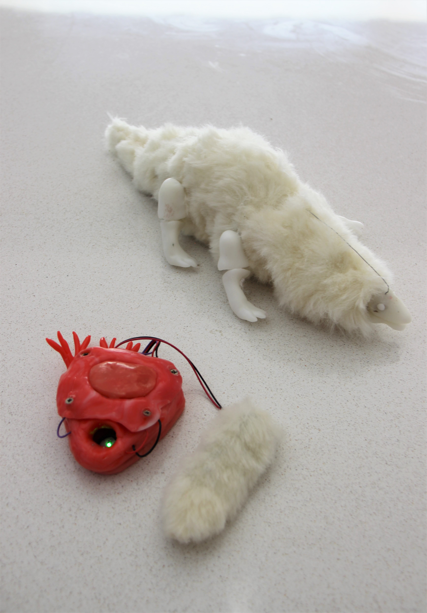

# *Two Products of a Non-agent*
## Julia Skorina ##
## 1701QCA Making Interaction 2020 Final Project ##

Who's heart beat is being represented, yours or the creature's?
Perhaps it is shared. 
'Two products of a non-agent' highlights our basal depedency on a process we cannot control. Human agency is often viewed as what seperates us from the animal world, but this work argues you and the lizard are both a product of the passive process of a heart beat, and vice versa. The user places their finger in the heart box that links them with the creature. The limp creature is wirelessly animated, moving in time and supporting itself while the heartbeat is there. When it is removed, the creature no longer lives. 

### Journal ###
[Process and reflection journal](/journal/journal.md)
