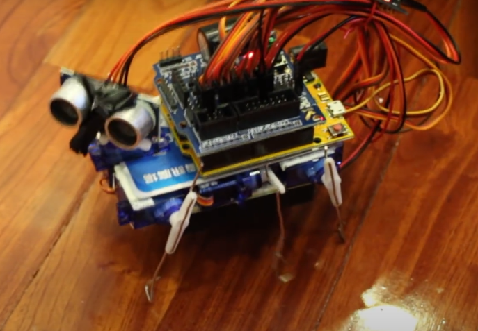
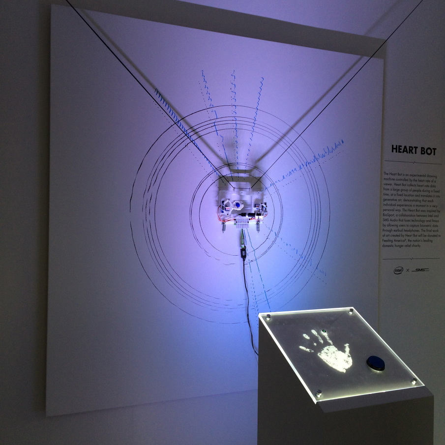
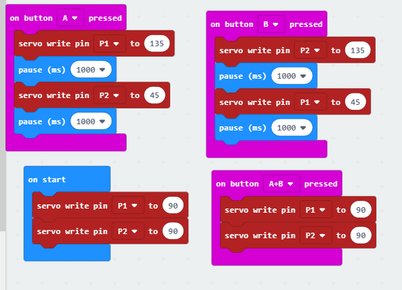
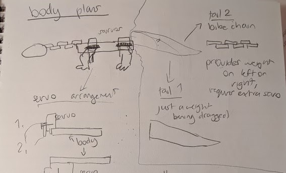
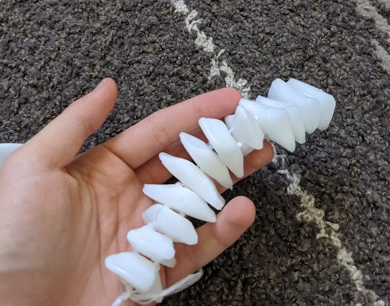
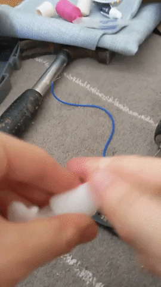
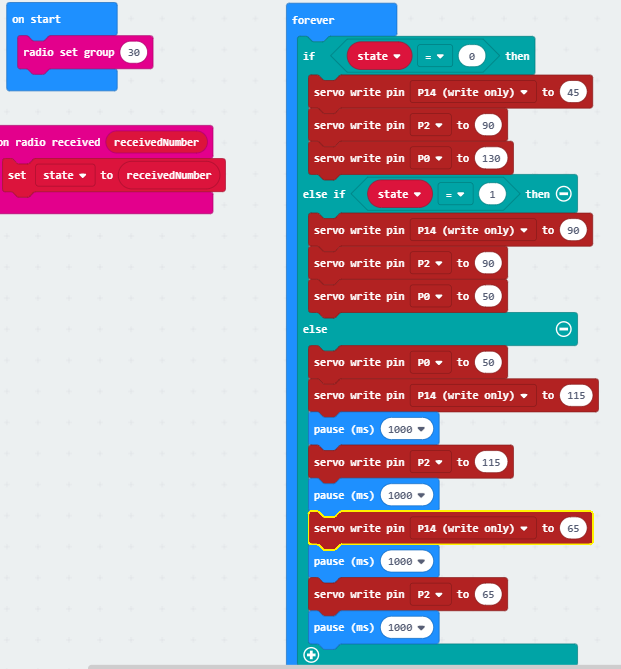
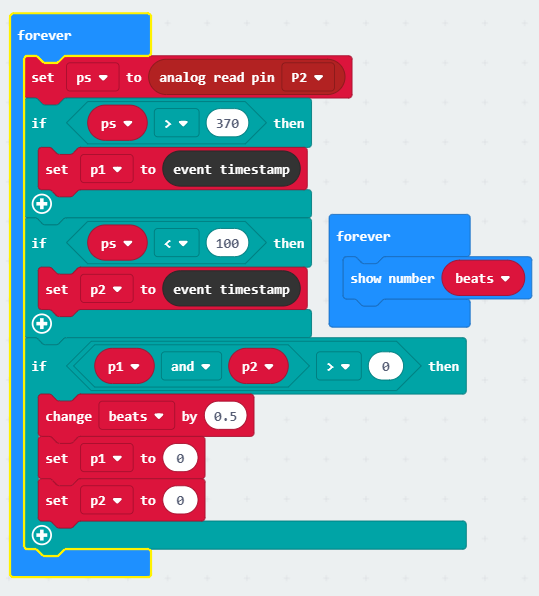
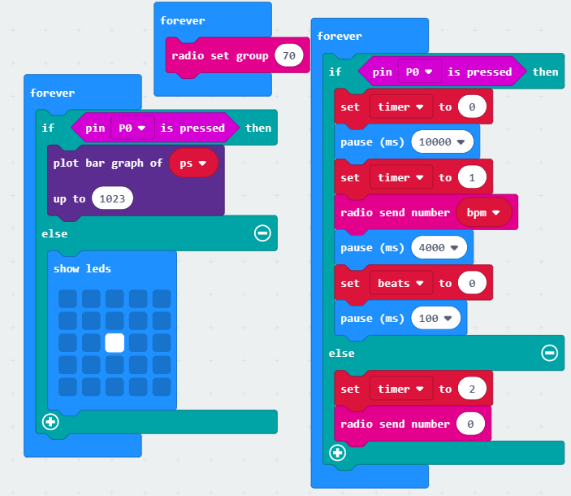

## 1701QCA: Assessment 3 ##
# Title: ‘Two products of a non-agent’ #

## Index: ##

**1. CONCEPTUALISATION**

1.1	Design Intent

1.2	Research

1.3	Design Concepts

1.4	Final Design Concept

**2. THE BODY**

2.1 	Materials

2.2 	Early Development

2.3 	Neck

2.4 Pulley

2.5 Finalising the body

2.6 Does it walk all together?

**3. HEART BOX**

3.1 Heart Module

3.1A MAX30100

3.1B Pulse Sensor Knock off

3.1C Official Pulse Sensor

3.2 Building the Heart Box

**4. FINAL TOUCHES**

4.1 Combining the code

4.2 Final Code

4.3 Lizard Exterior

**5. FINAL OUTCOME**

**6. REFLECTION**

# 1. Conceptualisation #
## 1.1 Design intent ##
In short: Creating a clear visual and tactile link between “heart” and “life”, and the inverse, “no heart” and “no life”. 

My project aims to highlight the dependency of a user on a passive life-giving bodily process (heartbeat) that they have minimal agency over through a robotic animal. It will challenge notions of humans as “unnatural” or above nature. 

_Rationale: 
Why heartbeat, animal and animation?
We aren't often aware of the ongoing physiological processes of our body that keep us alive. When we are aware, I'd argue we don't think about them as "this is keeping me alive right now" and more "this is a passive thing my body does" i.e.: heartbeat. But I'd argue that your body is as much a result of your heartbeat as your heartbeat is a function of your body. Heartrate is my process of choice because it fits nicely into functions we barely notice, don't think much of but is very clearly vital and immediate. 
Technology and our systems of defying nature are pointed to as counterexamples of humans as moving past nature and often constitute the human identity, but humans will never "graduate" from being animals however advanced we may be. The biology that keeps alive fails to constitute our human identity, but we are united biologically with all other bilateral animals by this basal process._

_Other animals are an emotional bridge between our polar images of humans and nature. It is an unusual tension, in which we both dismiss animal behaviours as less sophisticated, less intended than ours, but also anthropomorphise them, projecting our supposedly uniquely human emotions and behaviours onto them. Observing animals allows us to conceive of people as biological and natural, despite superficial differences. Through similarity we empathise and recognise a consciousness even in something we don't like to identify with._

## 1.2 Research ##
_My research and designs engaged in dialogue during the conceptualisation process. It was not a linear process. The influence of the research linearly discussed below pertains to different stages in the development of the final monitor lizard project. Their influence is seen in more detail through experimentation and conceptualisation of specific designs discussed later._

### Related project 1 ###
[**Photovore Insect**](https://create.arduino.cc/projecthub/studikasus/walter-the-arduino-photovore-insect-708207?ref=tag&ref_id=robot&offset=17)

This project illustrates potential mechanisms of walking. Most importantly it illustrated that no complex pulley mechanisms that I was envisioning were necessary to move legs, just servos. 
It also provides a way for the animal to lift its legs while it moves them forward so it doesn’t push itself back. The central axil that pivots the front legs up and down supports my already conceived ideas for how the lizard would walk with shifting weight. This project illustrated to me how I could move all four limbs (my original design only had two moving limbs and 2 limp limbs) and maintain forward movement. 
It also suggests an alternative possibly more reliable way to shift weight through rotation of the legs themselves (like hips) rather than the whole body as I plan to. In my lizard this could be integrated into the current design as independently rotating back and front half of the lizard, with one doing the weight shifting and the other mostly propping the animal up. 

### Related project 2 ###

[**Helen Pynor’s _The body is a big place_**](http://www.helenpynor.com/heart_perfusion.htm)

Helen Pynor often works with grotesque imagery with a biological focus. This work relates to my rationale, taking the heart out of the body and illustrating its function. It’s important that this isn’t a representation of a heart but a literal pig’s heart that is made to function outside of a body with blood flow. I don’t believe any link is drawn between passive bodily functions and life, but maybe in some ways the opposite, the function of a heart even in absence of life which is quite grotesque. 
Still it pertains to the primacy of heartrate as something passive, lacking agency and still functioning. There is a clear lack of involvement from any conscious thought for this system to work. I aim to challenge our agency of our bodies in this regard too.
For concept 2 (which I discuss later) I draw on the imagery of a heart circulating blood and pumping a creature back to life. Concept 2 later influences concept 1 in the animation aspect. 

### Related project 3 ###
[**Monster Chan - The credit card walking robot**](https://www.robotshop.com/community/robots/show/monster-chan-the-credit-card-walking-robot)

This project also suggests another option for making my lizard walk. Walking was a particularly uncertain aspect for this project. Here instead of shifting weight, the middle legs act like a prop up for the side that needs to be off the ground. This is similar to how I have a nail propping up the lizard in the centre of the body, but this nail doesn’t move up and down. Instead it is used as a pivot point. 
Too late into the development did I discover issues with walking, and this solution definitely would be my next solution had I more time, with back legs angling the body and front legs propelling it. It would work despite the heavy weight of the batteries. 

### Related project 4 & 5 & 6 ###
I have grouped these together because they are similar and serve a similar role in illustrating alternative ways of visualising heart rates and supporting that my lizard is at least somewhat original. Although no elements of these projects were burrowed, having alternatives is important.

[**Pulse**](http://www.jennykang.me/pulse)

This app uses your heart rate to generate natural fractal images of trees to emotionally connect the user with their heart rate. The project explores the psychology surrounding this imagery which is something I should’ve investigated. With a similar intent of drawing connection between humans and nature, this heart rate visualising app provided an alternative way to visualise heart rate early in the conceptualisation process. It was also more relevant to me when the project still had meditative function in which case I would have strayed away from a lizard walking to something more abstract and emotionally resonant.  
It was also confirmation that there was a tendency to depict heart rate abstractly and not draw a link between heart and animation as strongly as I intend to, justifying my project. 

[**Heart Bot**](https://www.element14.com/community/groups/sensor-technology/blog/2015/01/05/heart-bot-is-a-heartbeat-interactive-art-installation)

A drawing robot draws a user’s heart rate as a waveform radiating from the centre next to all the other previous users heart rates. This project has a focus on heartrate as an identifier, something that is unique to you. It also looks at heartrate temporally, keeping public record of many people’s heart rates at those moments in time- heart as a timekeeper. This plays into the rhythmic and clocklike paradigms of heart. It uses something we see in a medical context (ECG) as a collaborative medium. 
The concept of this installation is someone relevant to me in highlighting the passive nature of the heart, but instead looks at the identifying rather than life giving quality of your heart. Although one could argue the medical connotations of the ECG do carry life and death meanings. 

[**Heart Bloom**](http://heartbloom.rogierarents.nl/ddw.html)

Very similar to Heart Bot, except here the waveforms are drawn by a drawing bot into the shape of a flower (plant imagery like Pulse). It is also collaborative, with the audience pinning up their unique heart flowers onto a wall. There is emphasis on heart rate as an individual identifying thing and as an emotional gauge. Identifiable flower shapes are indicative of certain states like anger or relaxation. 
I believe I offer quite a different outlook on heart rate to these projects. I do not believe heart rate being unique has much to offer aside from novelty in repetition. I also believe the heart is heavily abstracted in these examples, not drawing as close a link of heart to life. 

### Related project 7 ###
[**Push puppets**](https://www.youtube.com/watch?v=F0php4pwrZc)

This is less of a concept and more of an existing design mechanism in the toy market that I’m drawing on. It was important in figuring out how I would slump over my lizard (“dead mode”) in concept 2 and later in the final project. Keeping strings that run through hard pieces taught is the mechanism that I settled on that I achieved with a pulley. Without my previous interaction with these toys I wouldn’t have this option available to me, even if it turns out that I can’t use it. 

### Related project 8 ###
[**Scientists bring a fossil back to life**](https://www.nature.com/articles/d41586-019-00186-x)

This is the video that lead my project from the beginning of the year. This is the image that I had in my head when thinking about concept 1 and largely has stayed this way in terms of presentation. I think it demonstrates that something can be “brought back to life”, even replicas of bones, by making it walk, and I was quite attached to this idea. Animation through movement feels very intuitive now. 
I drew a lot on how this reptile moves like where the legs are during contact, with what rhythm they move (do they move together or one at a time) and what role necks and tails play in balance. There is a rhythm here that is very easy to visualise. It is common to many reptiles because of the position of their hips (splayed walking). I went with “lizard” as my animal of choice because of the clarity this video offered to me. 

### Related project 9 & 10 ###
[**Sean Montgomery’s _Emergence_**](https://produceconsumerobot.com/emergence/)

This project draws a strong connection between a person’s heart rate and their being. They place their hands on the sensor, which sends each beat up (as light) the wires and through the room. Their heartrate creates an ambient track that plays in the gallery. 
This project is relevant to me thematically. Montgomery is concerned with bringing together humans and technology through shared “life-giving” electrical currents and illustrates this connection through the wire tree. I later draw on this imagery when thinking about the design of my heart box. I think it is very effective, especially with it’s scale, in depicting the universality of a heart rate, biological or not. 

[**Samuel Clay’s  _Pulse and Bloom_**](https://medium.com/supplyframe-hardware/using-biofeedback-to-create-large-scale-interactive-art-installations-8d5fe7509db4)

User’s place their hands on a sensor at the base of one of many giant flowers and their pulse shoots up the stem (as light) further illuminating the petals. Two people can also send two separate heart rates up simultaneously. 
Getting so much insight into this Burning Project from this conference was very interesting. They use Arduinos and talk through the process and challenges of using an Arduino. Especially interesting were the challenges posed by the circumstances: dust storms, demanding artists, and the difficulties on site installation in a place like Burning Man. 
From this I learned that a pulse sensor could be made from basic electrical components. I also have support for the prevalence of “sending light outward” imagery and plant imagery when it comes to pulse in art. It is also interesting to see a take on “cooperative” heart rates, although they don’t really need to be in sync. 

### Related project 11 ###
[**_Enlightenment_ Butterfly Skirt **](https://www.vice.com/en_us/article/nz4ynd/butterfly-skirt-measures-your-mood-with-wingbeats) 

The calmer your brainwaves are the slower the butterfly’s wings beat. 
I looked at this project early on while my lizard was still conceptualised as a meditative aid. It demonstrated that my very early idea has already been done, and steering me away from meditative aids. 

### Other research ###

**Walking cycles**

Although I had a clear image of the walking cycle from the robot fossil, life reference is still relevant. 
[This monitor lizard video](https://www.youtube.com/watch?v=t9z80QzM1xE) shows how exaggerated those positions of the head, neck and legs are. Just like the robot fossil, it moves by picking up diagonally opposite legs (back right, front left) and at the same time pushing off with the other two making that are making contact. 

This is in contrast to the walking cycle of mammals, who’s legs are angled underneath the hips rather than out (splayed). It is typical for mammals to walk (although there are other gaits) by picking up legs sequentially. Even if multiple legs may be off the ground at the same time, they are not moved together (back right, front right, back left, front left). This is difficult to describe, but is evidence in this [video of a dog walking]( https://www.youtube.com/watch?v=3Af2GDhRafQ).

This is important as a backup walk cycle in case it is necessary for only one side to be airborne at a time and still look natural. 

**Making a robot feel alive and empathising with it**

As discussed in my rationale, empathising with the robot is important to conceive of yourself as natural. For that reason the robot should also feel natural despite being a robot. [This article](https://thenextweb.com/podium/2019/08/16/heres-how-we-should-design-companion-robots/) gives tips on how to make companion robots, so robots that are easy to view as living and empathise with. My takeaways for my lizard were that it needed to show vulnerability. For me that meant definitely making it dead when you weren’t connected with it, taking priority over making it walk exactly how I wanted it to. This led to the implementation of elements of concept 2 (slumping over) into concept 1. The article also suggests that the robot servo no practical function if it is a companion robot, supporting my decision to not make it a meditative aid. I’m sure making it fluffy helped too. 

**Conversations with people around me**

When I asked them what else I could measure aside from heart rate they had some suggestions. Heartrate is by far the most practical and emblematic option, but I couldn’t choose it without considering other options. 

The suggestions were: 

body heat, blood pressure. The fluctuations in these are too gradual (over the course of hours) I also considered sleep which fits in this category. 

Breathing, strength (pressure). These are too voluntary. 

My friend also suggested the cooperative concept (like concept 4)- a car which each wheel controlled by a different person’s heart rate. 

I routinely consulted this friend about interface decisions especially surrounding the heart box. 

**Assigned Readings**

One of the readings that was assigned to us in class guided some of my methodology.
This was ‘The Design of Everyday Things’ by Don Norman (Chapter 1). 

It talks feedback and its importance to the user. I attempted to include as much feedback as I could:

  The screen shows when the microbit is on, but not connected 
	
  The screen shows your heart rate

  The lizard was planned to show the heart rate its receiving	
	
  The lizard shows when its dead (no heart rate)
	
  The lizard shows when its alive (heart rate is being received)
	

It talks about affordances and how they can be harmful if you signify an affordance that you don’t want or isn’t there. I attempted to remove all the other affordances by having no other obvious inputs other than the finger sized hole. I suspected there would be some uncertainty about where on the body the sensor should go. The finger hole is an anti-affordance for that speculation. 
The heart box is flat so  it can and should be placed on a flat surface. It has no buttons. The lizard also has no buttons or inputs other than the on off switch inside the lizard (not obvious switch). Furthermore, the user can only close the circuit required to start recording their heartbeat with their finger on the wall closest to them which is very easy to do with a relaxed rather than tensed finger, controlling the pressure the user exerts. 

The reading talks about conceptualisation, and how non mechanical processes that cannot be followed should have an intuitive conceptual map. The radio connection between the heart box and the lizard cannot be observed, but it is suggested through the fluffy battery pack connected to the heart box and a size and shape similar to a walkie talkie, with an artery “antenna” on the top left. There is no need to interpret any symbols.

## 1.3 Design Concepts ##
### Design concept 1: Chosen concept ###
Concept 1: A lizard that crawls in time/half time with your heartbeat.

_**Pros**: movement is a good link of heartbeat = animation. Perfect execution is not necessary for a functioning execution. It is moderately engaging, especially if the lizard can avoid obstacles. The user has a bit of agency with how quickly the lizard crawls._  

_**Cons**: If the lizard stops moving it does not appear dead, it just looks like its stopped walking. It’s not the strongest link between heart and animation._

### Design concept 2 ###
A creature that slumps over dead when there is no heartbeat. When you connect to it, it pumps up with blood and stands rigidly either due to pressure or with a different hidden mechanism but appearing to be pressure. The mechanical heart continues to contract to the user’s rhythm after that, filling all the plastic tubing vessels with blood and visibly circulating (like Helen Pynor's "the body is a big place"). It is like a soft bottle filled with red liquid that gets squeezed by a motor. There is minimal other movement, maybe just a wiggle. When the heart stops beating all the liquid goes back to the heart. 

_**Pro**: It's got big spectacle. It connects strongly to ideas of life or absence of life as a direct result of the heart._ 

_**Con**: This project relies heavily on the spectacle of blood circulating through the body, and therefore relies heavily on technical finesse. There is little margin of fault here before it looks bad. Aside from that, I think the interactivity of this is very limited, and would lose novelty fast._

### Design concept 3 ###
A competitive game in which each user controls and races with a small crawling creature with their heart rate. The faster the heart rate, the faster it goes. 

_**Pro**: This concept is the most engaging through competitive play and I think seeing the mildly unhealthy ways people try to increase their heart rate would be very entertaining (hyperventilation, jogging on the spot, inducing anxiety, all sound kind of terrifying but also thrilling)._

_**Con**: But in its competitive engagement it also detracts from the link between heart and animation, heart as life giving. Instead it becomes heart as an aid to victory. Users would certainly pay extra attention to their heart, but only to win, not live._

### Design concept 4 ###
A similar idea to 3, except cooperative rather than competitive. Users need to match their heart rate (matching the beats themselves would be too hard). Each user controls one half of a crawling creature. When they are synchronised, it crawls well. When their heart rates are too different, it crawls erratically. 

_**Pros**: I think this is an equally engaging concept. It also doesn’t encourage unhealthy behaviours. It has a positive awareness of the heart, and as something that is shared between you, another person, and the creature. That fits my message quite strongly._ 

_**Cons**: but ultimately, I think it still misses the animation aspect of the heart. I also think it might be too hard to match heart rates. Often users will feel frustrated by the necessary lag._
  
## Design process discussion ##
Using the Double Diamond design methodology resulted in the following outcomes:

**_these are also illustrated in the diagram below as I realise this is a lot of writing_**

**Discover**

During the discover stage I attempted to not assume the solution. I put my current idea (concept 1) on hold in order to develop a variety of concepts. 

I considered many options for which vital function to measure and how to visually represent them, even the obviously bad options (measuring sleep is an impractical idea for a project like this) as to not overlook any unexpected solutions. There were explorations into concepts aside from vital functions, into interactive creatures that encouraged positive awareness of self in other ways, such as shy robots that need a gentle approach. I considered using live insects as possible input. 

I consulted the opinions of others, presenting them with options and asking them how they’d react to each one, noting which ones got the response I wanted. My message was best communicated through concept 1 and 2. 3 and 4 seemed to be the most engaging. 

**Define**

In the define stage, I considered the most important aspects of my project, selected and refined the concept.  

_Life/death binary aesthetics_

The lizard needed to look and feel alive when you connect it to your body. I determined that the best way to communicate that a creature is being animated is for it to be dead in the first place: a binary was the most important element of the lizard’s behaviour. The robot companion article also recommended making your robot vulnerable and what better way than to give the power to give and take the life of this lizard. 

I imagined what can communicate the binary. Visual aids like LEDs and audio aids like speakers came to mind, but they were only sufficient as a supporting role. Concept 2 came into play here with the slumping over. I envisioned a pulley system being implemented, influenced by push puppet mechanisms. I also considered that I could integrate a small circulatory system on the walking lizard but decided that was not feasible with the time and resources I had available. Concept 2 would also be too difficult because it deals predominantly with liquids and pressure.

_Gait and movement mechanisms_

My lizard needed to move in a way that seemed intended and natural even if I couldn’t make it walk, but ideally it should walk. The walking lizard will either have to use an ultra-sonic distance sensor or walk in a circle. Latter may be necessary depending on the range of the radio signal. I’m reluctant to allow the user to control the lizard’s direction of movement. It needs to be just enough to be engaging but not excessive because the work is about an involuntary process.

I considered whether it has to move on legs at all. I determined it does because it needs to move rhythmically with the heartrate not continuously, but if legs were too difficult to implement I would be happy to support it on a wheel, or if it still didn’t work I would be willing to add a motorised wheel to propel it but reluctantly. 
I decided if I couldn’t make it walk, I would rather make it “dance”, possibly incorporating a cooperative element as compensation for engagement.  

_Heartrate measurement_

The heart rate sensor needs to be accurate enough that there is a clear “beat” and “no beat” that can be counted towards BPM. This is true for any of the concepts. 

It needs to move independently from the user and heart rate sensor because it is a separate living being, so I will use radio between two Micro:bits. 

**_Below is a diagram illustrating my selection process, resolution of anticipated issues and the influence of other concepts on my selected concept._**

## 1.4 Final design concept ##

The refined concept 1 now incorporated elements from concept 2. A lizard is animated by a user’s heart. When a heartrate is first detected, its limp body becomes rigid. After that it goes through a walking cycle at the same rate as the user’s heart, with a bright LED pulsating in time under its skin as well. When the user removes their finger from the sensor, the lizard is limp again. 

###Why a lizard?###

The “lizard” does not very closely resemble a lizard and neither did I aim to. It is a generic tetrapod, easy to impose my own intents onto without carrying many connotations. It does not have too many human/baby features that push no boundaries (a kitten) neither is it so foreign that the message is too on the nose (making the user relate to a fly). The empathy isn’t the most important part, rather the awareness of shared functions is. 

A lizard was also my basis of choice because they feel ancient. They are a basal creature and the lizard body plan is very much the foundation for all tetrapods. A fluffy lizard like animal encapsulates many of the animals we relate to. The heartbeat is also very primordial, a life-giving passive process that is shared by people and all other bilateral animals. You owe as much of your being to your heart as long dead fossils once did. 

### Interaction flowchart ###
Some of the values here have changed and also the LED is no longer part of the project. 

# THE BODY #

### 2.1 Materials ###
The materials I ended up using 

•	Electrical tape

•	a second microbit

•	5 small servo motors

•	1 large servo motor

•	Pulse Sensor from Pulsesensor.com

•	A pulley wheel

•	Crimping tool

•	Two 6v battery packs

•	Two 3v battery packs

•	Super glue

•	Hook and Loop fasteners

Some things I already owned

•	The first microbit

•	Assorted screws, nuts and bolts from around the house

•	Thermoplastic beads

•	Binding wire and thread

•	Nylon string

•	Faux Fur

•	Heat shrink tubing (could’ve been straws) 

## 2.2 Early development ##

### Connections ###
Most of my connects are solderless and use twist and tape method from the replication project. I used the soldering iron once for a particularly difficult connection. 
### Servo Basics ###
I already knew how to operate servos from classwork. I used a simple bit of code with button a and b presses corresponding to different servo positions to test functionality of my connections. 

First I connected a servo just to the microbit (Input line, Vin and Ground) and found out in [this forum](https://arduino.stackexchange.com/questions/40145/micro-servo-is-not-working-with-arduino-uno) that if the Micro:bit is also connected to a computer via USB, it makes the servo jitter because the voltage is too high. I keep this in mind for the rest of my experimentation, but I will be using an external battery pack for most of it. 

First connecting the external power source I learned from this [video](https://www.youtube.com/watch?v=9qgABVkvbYI) that the battery pack ground also has to connect to Micro:bit ground. 

Adding more servos (four in total, they started jittering again. It appears jittering has everything to do with power. I needed to increase from my 3V to a 6V external power source and they worked again. 

In later experiments I kept finding that batteries were running out quite quickly and that was often the reason my servos stopped working suddenly. 
### Walking plan ###
Without shifting weight it would definitely just shuffle because of how the legs would have to touch the ground when pushing off and also when bringing them back up.

I understood that my designs involving shifting forward weight with the head were necessary to make the lizard walk. This is supported by the photovore insect project and Monster Chan from my research. 
In early plans, the leg pairs were diagonal, that is the back left and the front right would move in tandem and the inverse is true. The neck (and then I thought maybe the tail) would shift the weight of the lizard onto the leg that was contacting the ground, and the one that is already in a back position would become airborne and rotate forward. In these sketches I also thought that two halves of the body rotated independently of one another.

I ditched the tail as another shifting weight (tail 2) as the servo count was getting expensive. Instead the tail is a counterweight.  
I considered the different angles the servos could sit on and how they would affect movement. I nonsensically thought that angling them a certain way would prevent contact on the legs movement back. Option 2 is influenced by the photovore project, but I decided against it because it requires constant contact to push off since its vertical position doesn’t change. I went with option 1.5 because it moves the body back and away so that it moves in a sort of zig zag motion, ideally. 

Here was my final idea of how the Lizard was going to walk.

### First frame ###
I made the first frame out of thermoplastic with a slight upward angle in the sides for the servos to sit on. I held everything down temporarily with screws, and the legs were bound to the servo arm with wire running through drill holes. A large screw supported the body in the middle. The wires were fed through a hook. 

I couldn’t test out how well this body moved. In the process of connecting one of the servos with the leg I broke it. Another servo had a gear that was thicker than all the little plastic arms that it came with. I forced one of them on it, which widened the arm. I forgot this and later when the last arm I had left was too loose for the last servo and I used a screw to secure it. I guess I used the wrong screw, because it loosened the gears inside the servo and I couldn’t fix it. I bought another one later, but for now, there’s how the front legs move without a neck.

## 2.3 Neck ## 
The neck saw some design iterations from the original. I realised the original bike chain design wouldn’t turn evenly through the spine, and that how well it turned greatly depended on the friction between the pieces. This was too much precision for me.

I changed the design modelling it after my friend’s crocodile rattle toy like this one:

I thought I could skimp out on work just by connecting the plates with thread, but there was too much rotational movement and I realised I would have to adhere to the original crocodile with a strip of canvas running through the middle as it only has one axis of movement.

I used super glue to join the neck pieces to the canvas.

In my plans, the degrees for left and right were a bit extreme (45 and 135). After settled for an average between those and neutral (90) and it worked well. 

Although I had to add a supporting wire to the neck. The neck tended to curve back so much that when the servo turned to the other side it didn’t follow. It also bowed too much. 

The supporting wire was quite a nice result. It has a good bobble to it.

### Does the neck actually shift weight to enable walking? ### 

Experimenting with just 2 legs as I still didn’t have the 4th leg servo. To my surprise, balancing on the screw the lizard was able to walk! Here it also becomes obvious that the walking servos can be written to one pin. 

I thought maybe I could make the walking more gradual as these motions are quite violent. I created degree increments and separated them with small pauses. However, this just creates stuttering and sounds awful. 

### Neck on final body ###

## 2.4 Pulley ##
### Pulley tension ###
The pulley servo tightens the limbs of the lizard enabling it to walk, and releases when it is “dead” to make the lizard drop. It works by threading nylon string through the joints and loosening or tightening it up with a stronger motor (6V) with a disc. When it’s tight, the joints come together rigid in a lock and key fashion. The string is guided through the body with eye screws. In my original sketches this lock and key was round.

The sphere was too slippery though and even while rigid the limb rotated. 

Next I tried a cube lock and key, but it turned out too tight and would slot correctly without effort from me. It is a good lego-style slot in though, quite strong and may be useful in future projects. 

Lastly I went for in-between: a pyramid lock and key (lock indented with edge of sharpener). To my surprise this worked. The leg is soft when the pulley is at the original position, and tight enough that it can bring the lizard up off the ground I believe when the pulley is at maximum (180) position. 

### Does the pulley servo conflict with the walking servo? ###

I connected this leg to the walking servo with two screws, but the servo arm I did not screw on. 
The leg I’m using here is the same as in the previous pulley experiment. 
The walking servo was held in place with the pulley servo with a rubber band. 

This experiment did show: yes! the legs move back and forth like usual. There is minimal conflict between the walking and tension. 

**_Angle of the string_**

In this experiment I learned that the angle at which the string is pulled relative to the walking servo is very important. It needs to be parallel to the walking servo, otherwise it’ll exert most of the pressure behind the servo (and therefore stop it from functioning or break the servo when the servo arm is screwed into the servo). For this reason I also left behind the angled body design of the previous experiments for a flat body where the angle of the string is much easier to control. The limbs needs to be perpendicular to the walking servo so that the string pulls “into” the servo, not up. 

**_Tightness_**

In the code above because of how I positioned the pulley, the tightest position is at 0, so all the numbers are inverse. Of course, if the pulley pulls in the other direction enough (180) it’ll tighten that way as well, but that is not how the string intends to be pulled. It is not a major difference. 

The numbers here are ideals for this particular experiment in tightness discovered through trial and error: too tight and the leg cannot move when it is taught, too loose and when the leg is “dead” it can twist in its socket and shorten the string available to pull. 

In the final body this ideal tightness should be set first for one leg, and then manually the strings should be tightened (with a screw) for all the other legs to maximum tightness at the same position as the first leg is most tight. 
 
**_Notes for the future_**

The other viable design would be design 2, with the servos being on the underside of the body and rotating on the x rather than y axis. I’ve previously discussed why this isn’t my preferred design, but it would work with these servo requirements. 

I also worry that the pulley can keep one leg tense, but 4, maybe not. If so I can fall back on my front leg only design that tightens the front two legs and the back legs are decorative. 

### Constructing the final limbs ### 
Just to be clear this is what I mean by lock and key.

Step 1. Make the pieces.

The lock and the key.
The lock is a blob with one flat side and a triangular based pyramid indent on the bottom. I made these indents with the corner of a sharpener container for consistency, with a face of the pyramid towards the flat side. 

The lock is shaped like a leg. When the leg is shaped, I melted the top of it again, wet both the key and the lock (as wet soft thermoplastic doesn’t stick) and moulded the leg into the solid lock. This way they match. It was important to ensure they are all equal lengths.

Step 2. Draw the centre of the servo using the arm as a guide based on the lowest point of the lock. 
Drill two holes, one near the bottom and one just above the centre. 
Trim the servo arm. 

Step 3. Screw the servo arm to the servo

Step 4. By rotating the arm to access the drilled holes to screw in some screw. Be mindful of orientation of servo on the body 

Step 5. Drill first from the inside of the lock piece through the two faces of the inverted pyramid that are not the flat side. Drill towards the top and towards the body.

Step 6. Redrill those holes, but downward, with the key piece the lock so that the key piece has small holes position matching the ones in the lock piece.

Step 7. Drill the key piece from those holes to the underside of the leg.
Any burs that are present in the context of the key and lock should be melted with a hairdryer. 

Step 8. Thread 2 threads of nylon string through each hole with a needle. A knot is tied on the underside of the leg. They should not meet until they've left the leg.

Step 9. Thread both nylon strings through the one hole in the frame above the servo. 
Here I also put on some heat shrink guards on the nylon strings because one loose string got cause in the large servo and I had to pull it apart to make it work again. Minimising loose strings this way.

Step 10. Drill 4 vertical holes in the pulley wheel equally distributed around the edge. Thread the nylon strings of each limb through the bottom of its corresponding hole. 

Step 11. Insert a screw next to each string hole in the pulley and four in the inner ring of holes the pulley. 

Step 12. Turn the pulley all the way clockwise. Stretch the strings between the screws until their maximum tightness while the pulley is in this position and screw them down. 

### Can a pulley tighten all 4 legs? ### 

I have bought the 4th servo and am able to test out how the pulley works with all 4 legs. 

**_Power supply issue_**

When I tried to test walking, I ran into a power supply issue. A 6v battery definitely couldn’t sustain 4 small servos and 1 large servo as it cannot sustain 2 small servos and 1 large servo. From my previous experiments, 1 large servo and 1 small servo are just about the limit. I will need to purchase another 6v battery. My progress here was stalled. 

For the mean time I just tested out whether the pulley could tighten all 4 legs. I also started using the second micro:bit as a wireless controller, to avoid interfering with the lizard and for convenience. 

The results show that the pulley can tighten all four legs enough to stand on with some trail and error of manually tightening the screws. It cannot get itself up anymore as the experiment with just one leg did because the body cannot turn as freely to accommodate the lock and key, but with some wiggling of the walking servos combined with tension the locks can find the fit I’m sure of it. 

The neck and LED are also in action here. 

 

Once again, the smaller the number the tighter in this code.

## 2.5 Finalising the body ## 

### LED ###
The 1cm LED that I used diffused quite well through the lizard’s skin. It is very bright. 
I did my maths wrong calculating what resistor I’d need. The guy at the store who helped me find the 27 ohm resistor that I thought I needed according to my maths said that one should only need a 47 ohm resistor according to his book. 
The maths I did was influenced by this [site]( https://www.evilmadscientist.com/2012/resistors-for-leds/). 

There is a 2.4V drop according to the manufacturer

I’m bringing that down from 3V

	3 – 2.4 = 0.6V
	V = I*R 
	0.6 / 0.025 (suggested value) = R 
	R = 24 ohms
	
Oh well! It definitely works with 47ohm.

I did a basic gradual loop: 

This LED was places between the two front legs, neck servo and pulley servo, with the wires going directly through the body onto the other side with the microbit shield. 

### Microbit on the lizard ###

I thought about how I might bring the number of necessary pins down to 3 in order to fit in just a microbit on the underside of the lizard. I knew that I could write all legs to one pin because of how I oriented them (positive degrees corresponds with movement forward on one side and movement back on the other) 

I still, however, had 4 pins: legs, neck, pulley and LED.

I would really like the LED on there. I thought that maybe some of the servo writes could change the brightness of the LED, and they could, but it seems servos operate on such a small difference in current, it doesn’t have much of an effect. 

I managed to fit the microbit shield with extra pins onto the underside. 

I later secured the microbit in there with a rubber band that is stretched by two screws across the width of the body.

### Tail and power supply ###

Early on I decided that the tail would not also swing from left to right, and instead house all the batteries. The tail is a strip of strong fabric. After I had to replace a 3V pack with a 6V pack, the body got considerably larger, but it worked. The 6v battery on the bottom is being held in place by a screw and the other two batteries are connected with Velcro. 

Shortened all the wires and mapped all the legs to their own pins since I thought I could get quite natural motions like this. 

 

At this point the connections mapped like this:

P1: Back right

P2: Back left

P12: Front right

P16: Front left

P0: Pulley

P15: LED

P20: Neck 

### Grips ###

I added some grips to the feet to assist the lizard in getting up on its own. I stretched white, self-adhering silicone tape over the feet.  

## 2.6 Does it walk all together? ##

### Power Supply Issues, again ###

Even with enough battery packs I ran into an issue I’ve never encountered before.
When I hooked everything up it started to shake.

 

This was clearly a power issue. After removing the code for some pins the issue stopped. Adding one servo at a time, it came back.

I had 8 pins connected when I first tried to test its walking ability: individual pins for the legs (4) as I thought it would move more organically with individual control, pulley, neck, and LED.

It appears as though the Micro:bit can only write 3 signals at a time, because when I added 1 servo Pin to the LED, Pulley and Neck command it started shaking where it didn’t before. After I replaced the LED pin with a servo pin it didn’t shake.     

I knew I could write the legs to the same pin, but this meant I still had four pins.

I had to remove one and it was obviously the LED. It is a shame and I think it added to the strength of the connection between the lizard and the heart beat but nothing can be done on such short notice. 

### Can it Get up? ###

Angles corresponding with motion on each leg:

right back 90+ = backward

Left back 90+ = forward 

right front 90+ = backward 

Left front 90+ =  Forward

So lefts and rights move in tandem. 

I thought it would be cute if the lizard could up with the front legs first like a real animal, but this was no longer feasible.

My theory earlier about it needing to move the legs a bit for the keys and locks to fit together and fully tense up the pulley was true. Once I combined the pulley tensing sequence with leg movement it got up with no problems in 5. When the leg moves, the keys have a chance to move closer to the lock and every time they do their position is further secured by the pulley tension.

This can be done by the movements of a regular walking cycle. 

### Can it walk? ###

For these tests I added a screw in the chest of the lizard where the LED used to be. It is as long as the legs and touches the ground with them. 

 **_Script_**
 
This was the walking script in line with my previous ideas of how I was going to make it walk:

**Start (Button A in this test):**

Head is on a severe tilt (P14:25)

Pulley is loose (P0:130)

Legs straight (P2:90)

**On input (Button B):**

Head is straight (P14:90)

Pulley is taught (P0:50)

Head rocks left (P14:70): Lizard tilts left very slightly 

---pause---

Left feet back, right feet forward (P2:65)

---pause---

Head rocks right (P14:110) 

---pause---

Left feet back, right feet forward (P2:115)

---pause---

loop until…

**No input (represented by button A+B):**

Head is on a severe tilt (P14:25)
 
Pulley is loose (P0:130)

Legs straight (P2:90)

**_Centre of Gravity_**

The head wasn’t doing anything at all because the centre of gravity on this lizard is way back in the tail. Who would’ve thought that 10 batteries would weigh a lot.  I tried to shift the pivot screw back. The microbit shield was previously in the way and now I didn’t need it anymore with only 3 pins used. 

The microbit is held in place by bolts fitting into snuggly fitting drilled holes in a staircase piece to prevent the restart button from being pushed. The bolts are both keeping the microbit in place and holding down the wires. The 3V battery pack has had to move from the tail to the chest. 

A series of complications have occurred here. When I was doing my initial experiments with the walking, I did not account for the weight of the batteries and the corresponding centre of gravity. In those experiments, the battery was being dragged behind. There they are attached to the frame, bringing the centre of gravity backward, away from the head. 

The second issue is that the pulley did compete with the legs after all. In my earlier experiments it didn’t appear so but with the whole weight of the lizard its clear more torque is needed to meaningfully propel it. The legs do move, just not enough. 

My first solution was to prop the lizard up with a screw in the back instead of the front, delegating some of that battery weight to the screw which can be tilted on. I tried a variety of screw lengths. None of them facilitated walking because the neck was so angled downward that it was hitting the ground, and the back feet were not touching the ground. The lizard did not propel itself.

My second solution was a screw, a shorter one, and also moving one of the large battery packs to the front as well.
This moved the centre of gravity, but I then realised the lizard was just too heavy to be affected by a plastic head. 

I tried putting a large bolt in its head, totally ruining the lizard’s appearance. I experimented with various weights on the head but I ran into the same issue of the head hitting the ground. Without suspension, all the mass that’s meant to be tilting the lizard is just supported by the ground. 
I tried to support the neck some more with a suspension wire underneath the neck as well.
This did nothing but limit the neck’s movement.

I also turned off the pulley and taped the legs together, so they were rigid on their own. I knew if this solved my issue I could just glue the lock and key together and leave the slumping behind. This certainly helped, but not to the extent that it was worth abandoning all the effort I put into slumping. 
 

If I had more time I would experiment with better means to shift the centre of gravity. I would also angle the neck up to counteract the downward weight. I would change the material with less elasticity. The fabric is elastic enough that there is marginal y axis tilt that becomes obvious with increased weight. A hard plastic sheet would do a much better job, and would also likely not need suspension with a wire. 

At this stage there is no way I can, with reasonable expectation of success, enable this lizard to walk by the due date. The other option I didn’t (and can no longer) explore here is the aid of the wheel. But in my decision framework I made it clear it is a high priority for the lizard to move rhythmically rather than continuously. I am falling back on the option of just having the lizard shuffle in place. It still retains the ability to slump over and pick itself up. 
 
 
I removed the grips (they were preventing the lizard from flopping back down), removed the bolt, moved the battery back to the tail. The batteries in the tail are held in place with Velcro in the case that they need to be changed out. The battery on the underside of body is also being held in place by Velcro and also a rubber band that wrapped around two screws. The Velcro keeps it from sliding and the rubber band keeps the battery from coming off the Velcro as might happen being on the underside of the lizard.

Here is the result (this video is taken with the upcoming heart box):

### Wiring changes ###
**What I thought the wiring would look like:**

Sender Micro:bit

Receiver Micro:bit

**Changes made since then** 

Sender Micro:bit

Receiver Micro:bit

Here is what the final lizard is built like:

# 3. HEART BOX # 
## 3.1 Heart Module ##
## 3.1A MAX30100 ##
There were a lot of issues with the heart rate monitor. The original one that I used was MAX30100. 

It was made for Arduino and not for Micro:bit as it’s pins connect to the clock and data pins of the Arduino. Furthermore, the [library](https://github.com/mfitzp/max30100) I learned some Micropython for seems to be written in Python and needs to be adapted to Micropython to actually work, which is way beyond my capacity. This is according to this [forum]

(https://forum.micropython.org/viewtopic.php?t=8101&p=46069). I assume this is why it was giving me memory errors.

I did learn all the Micropython commands I knew in MakeCode, how to import a library and how to use the serial screen. 

## 3.1B Pulsesensor.com knock off ###

My backup analog heart module arrived in the mail just as I started feeling lost. It seemed quite similar to the PulseSensor.com sensor so I just followed the Micro:bit instructions on their website: Vin to 3v, G to ground, Input to any pin and just read analog pin for signal.

It worked well, with clear “beat” and “no beat”. Although I found that the pressure applied was very important. Too much and the signal was maximum (1032), too little and it stayed pretty low (<300) and didn’t fluctuate much in both instances. Also very strangely sometimes the sensor detected a pulse on my desk which I can only guess has something to do with my lamp. 

I needed to figure out how to detect a beat and make sure this sensor was accurate, but **IT BROKE! The connections were soldered on and didn’t take much twisting. I ordered the actual pulsesensor.com one.** 

I thought about two methods for when the next one comes. Until then I will use the simulator, dragging the pin up and down in time with a metronome:

**method 1**
If PS is 0, and within X time it is >500, count that as a beat, otherwise the time expires and repeat. Make  a counter for the beats and after 15 seconds display beats per minute. 

**method 2**
Alternatively, if PS = 0 and PS > 500 in time X, mark upper or lower with timestamp, repeat for next beat and subtract the timestamps. Average out after 30 times gives average time in between beats (this is similar to my timing gate replication project). 

### Method 1 ###

**Step 1: detecting a beat** 

When signal is above 370, box 1 is checked

When signal is below 100, box 2 is checked

Both boxes checked, count as beat, increase ‘beat’ by 0.5 because the beat is counted twice, on the rise and fall. 

Uncheck boxes.  

**Step 2: Timer**

Adding a clock that shows T for 10 seconds and displays BPM (number of beats X 6) afterwards, then resets beat counter. 

**Step 3: Timer linked to beats**

While timer box is unchecked measure for beats. When it is checked show BPM. 

**Step 4: Testing if this method gives accurate BPM**

I have to test accuracy with manual inputs guided by a metronome, so there’s a degree of human error. A few trails gave these values:

So accurate enough, at least the system. Might take adjustments with sensor when it arrives.  
I can also decrease the sample from 10 seconds to 5 if it feels too laggy on the user (probably will).

**Method 2**

I am dismissing this method because method 1 is effective enough. It also didn’t account for the return of the beat from 1032 back to 0 (shouldn’t be counted as a beat). This is dealt with in method 1 simply by halving it. The 10 second period is an average already. But the returning “beats” cannot be counted in method 2 because this produces in inconsistency in time (illustrated below) This could most likely be worked around but at this point it is needlessly more complicated. 

### Knock off pulse-sensor code ###
This code was written before any of the components were put together, and their problems were not yet apparent. This code is the foundation for the final code however. 

**Sender:**

_Heart code_

Identical to final heart code in section 2.7 

. 

If bpm is 70 beats per minute, how much time is that in between each beat?

Bpm/60 = 0.8 seconds. 

0.8 x 1000 = 800 ms

. 

Some maths converting the four current millisecond increments to fractions: 
	8 X 30 = 240 
	2 x 50 = 100
	1 x 1000 = 1000
	1 x 100 = 100
		= 1540 ms total duration of cycle
	30ms/1540 = 0.019 
	50ms/1540 = 0.032  
	100ms/1540 = 0.065
	1000ms/1540 = 0.649
	
 

_Servos_

On start: dead mode. When rhythm detected, tense up and straighten neck. After that, loop walking cycle separated by “wait” time. 
If wait stops being above 10ms, go back to dead mode. 

_Some touches_

On sender Micro:bit:

To ensure that only a finger will set off the timer, skin should close a circuit and press a pin (pin 0). 

If it’s not pressed, then timer is set to 2 so it doesn’t affect anything and radio signal is 0. 

If it is closed, draw heartrate bar graph on LED screen (feedback for user)

Indicate readiness but absence of input if pin 0 is not closed with LED dot. 

 

## 3.1C Official Pulse Sensor  ##

The new sensor is very similar although somehow is less reliable than the knock-off. The finger needed to be held in a very specific position, midway between the flat and the tip of the finger, to get a good reading. 

I spent a long time trying to trouble shoot this with various spacers thinking it was the pressure I was putting on it. Then I learned how the finger should be positioned through looking at some third party material like [this](http://www.circuitstoday.com/pulse-sensor-arduino)

Worth noting is that on the sensor’s website the sensor is shown on the flat side of the finger.

It is accurate. I compared readings with a heart rate phone app and they were nearly matched (sensor 72BPM from phone 70BPM) in the 5 trials I did holding my finger correctly. 

### Levels ### 

After some experimentation the thresholds I found that were most reliable were 450 (lower threshold) and 550 (upper threshold). A much smaller variation than before. 

For this reason I exaggerated the difference on the display screen with some math manipulation. 

### Timer iteration ###

When timer state is 1 (run out), show bpm. This is only for testing purposes and it will not show BPM in the final. 

When timer state 0 (ongoing), show the graph plotting heartbeat for feedback to the user about whether their finger is positioned correctly and subsequently whether their measurements are being taken correctly. This will be in the final code. 

When timer state 2, where nothing happens except the start screen.

Of note is that negative numbers are plotted positively, so if the input in the sensor is less than 200, every number below that is a negative plot. This is not a major issue since the sensor doesn’t fall below 300 even when finger isnt being read. Just notable. 

I then added Pin 0 to the new code, the gate that allows measurements to be taken when a finger closes it and confirms contact. I did this (already in the previous code) because there’s really no way to easily turn off the microbit, and even if there was I wanted this to be a minimum touch control aside from sticking your finger in, without asking you for confirmation for whether or not you want to start sending this bpm over. 

Without a BPM to send over, the lizard doesn’t move. 

Closing Pin 0 during timer state 0 displays the graph and during state 1 displays BPM. I initially implemented this incorrectly. There was a conflicting command of “when timer is  = 1 show BPM, otherwise show graph” I included earlier, and also “when timer is 2, show start screen”. The screen flashed both. 

After that I added the condition of pin 0 being pressed and timer state being not 1 for the LED to display a graph. 

After that I found that when Pin 0 was released, bpm was still being displayed. I wanted all measuring functions to cease, so I added a ‘clear screen’ which made the start screen flash but I don’t mind it too much. 

### Timer-gate issue ###

My condition of ‘while pin 0 is pressed go through measuring sequence’ doesn’t immediately stop when pin 0 is not being pressed. It still displays BPM at the end of the timer and would therefore at this point radio a very wrong bpm to lizard. 

My theory about why the BPM would still display is that pause is not a command that gets overridden by new input, so if pin 0 was let go of and not touched it should not display bpm like it would if the finger touched again.

This turned out to be wrong. It did display BPM anyway.

My second theory is that the If pin 0 is pressed sequence cannot be interrupted by new input until its done. I even made pin 0 release as a separate input hoping it would override the sequence.

I looked at using the other similar command to logic, “while”. 

This also didn’t work. I thought maybe its also because pressing a pin is more like an event than a continuous input, like pressing a button, so I tried ensuring that it was a state by creating an explicit state when pin 0 is pressed. This also did nothing. 

I found a way to hide that the sequence was still going by clearing the screen when pin 0 isn’t being pressed with clear screen. This worked and also showed that pin press is definitely a condition not an event. I was determined to actually solve the issue though. 

There was extensive experimentation with averages. I divided the 10 second sequence into four parts and recorded each part as a separate variable that would get pushed down with every recording. I did this so that the sequence could end sooner and the new state of pin 0 not being pressed can take over.  

	write bpmold -> bpmoldold, 
	write bpmnew -> bpmold

This worked terribly, giving inaccurate values. 

I decide this is not a major issue.

I guess its really not that big of a deal. The user has feedback for when the pin isn’t closed, and since they don’t see the radio signal being sent they’re not aware of the issue. If the user connects pin 0 again during the same sequence, their pulse will continue to be measured. With how It was before, after 3 sequences (the pulse sensor has some sort of internal adjustment period) my pulse stabilised at a realistic 75. So really this just represents a lag of a maximum of 10 seconds between the input of the user and a response from the lizard, which was already there and so far necessary when it came to updating the BPM. 

Although I can shorten the timer and take more frequent measurements, I feel a longer timer is more accurate since the end of the timer interrupts the measuring process. I also feel the lizard will move to erratically with a smaller sequence, and itll be unclear whats going on.

I spent some time using the masking of the false bpm recording to tell the user very briefly that their sequence was recorded. I couldn’t make it short with the pause command, so I made two displays conflict and make them flash quickly. 

 
I instantly decided against this. It’s a confusing signal.

Unlike the start screen that very much implies a static state with not much going on there’s very little I can fit on the screen to explicitly say that the sequence was captured (other than spelling it out, which would take way to long) that would not be a symbol the user would have to decode or be told about. The user doesn’t need to know the backend, they just need to know their pulse is being taken. 

This is the code I ended up with. 

## 3.2 Building the Heart Box ##

### Research and Design ###

For the aesthetic design of the heart box I consulted my research for pulse interfaces. I found no useful similar projects using a finger sensor, not even children’s finger clamps. 

Common imagery among my sources were vein like trees or other plant imagery like Jenny Kang’s ‘Pulse’ program. In Sean Montgomery’s ‘Emergence’ this is also true, with tree-like wires transmitting your pulse in a wave radiating from you. A similar trend is seen in ‘Pulse and Bloom’, where the pulse is send up the stem of the giant flower. I was interested in the outward motion created by your pulse, as ‘sending out’ is exactly what the heart box does. I thought about using a branching graph on the LED screen. None of these projects use an interface that can be adapted to a finger sensor. 

In terms of similar microcontroller pulse sensor projects, they are all very practical and not concerned with the user experience. 

The other designs I considered was the heart box being the head of the lizard or the body of the lizard to which you were giving life with your touch, but I decided this implied a lot of agency and made the user a Dr. Frankenstein. 

I wanted the lizard and the user to be as equal as possible despite their relationship. I focussed on their commonality: the heart. Through putting their finger in this heart, it is somewhat ambiguous whether the heart is the user’s heart or the lizard’s heart and so it is shared. I planned out a box resembling a heart.

This is the design I resulted with after some experimentation. My original sketches were incoherent. 

### Experimentation and Construction ###

I found that the LED screen emitted enough light to be seen through the thermoplastic and so I covered it with a thin cover that diffused this light very nicely. For this reason, I had to let go of the branching LED, but I retained the branching imagery of other projects through plastic arteries on the top left and through exposed wires of the pulse sensor which resemble smaller vessels. I made these decisions rapidly and intuitively while physically playing around with its design so I cannot speak for the exact influences. 

The pulse sensor wires are thread through various drilled holes in the bottom and middle layer of the heart box. 

The user sticks their finger through a guiding hole. I angled it so the finger, when at rest, would be in the correct position. I made the finger hole with my thumb to accommodate larger fingers, but this still turned out too small for large stepdad index fingers. His pinky still fits though. 

I wanted this heart box to have one input and no buttons. I wanted the user to have the least agency in the experience possible, as really the input that controls the lizard is even out of the user’s direct control. For the reason the pin that needed to be closed to start the sequence needs to be triggered as part of the only action the user can do. 

To strengthen the connection between lizard and heart box without creating a relationship of agency, the battery pack that powers the heart box is covered in fur like the lizard is. This suggests the relationship but doesn’t position the lizard as something being acted on. In fact, the lizard is providing as much power to this heart as the user does. When you disconnect the furry battery pack nothing works. 

**Gate**

I stripped wires in the middle. 

 I thread wires through drilled holes into the finger hole, into the wall that is closest to the user as that one most accurately positions the finger. The exposed wire is the only part showing.

These wires do not leave the heart box as the pulse sensor wires do and connect to the microbit directly through the underside of the second layer. 

I meant to use copper tape to cover the exposed wires, but I found that the copper tape wasn’t all that sensitive. Removing the copper tape either changed nothing or improved sensitivity to the pin being closed. The exposed wires did a good job most of the time, but after sitting dormant for some reason the gate would not close until some attempts. My guess is either after some struggle the moisture in the finger helps the conductivity, or the wires are accumulating current? I don’t know enough about physics to know for sure, but after a few strokes it starts to work.  

### Demonstration with heart box ###

I’m super happy with the result. The diffusion of light eliminates a possible user tendency (like my mum) to read the bars too much (say minor fluctuations which to an inexperienced user may appear to be pulse and not just noise) and instead just see a more ambiguous beat that clearly slows down and speeds up, but indiscernible in the level that the sensor puts out which is entirely irrelevant to the user. 

# 4. FINAL TOUCHES #
## 4.1 Combining Code ##

### Integrating Lizard Microbit ###
 
I changed the pauses in between steps to be ‘wait’, which is the received BPM converted to ms. 

I also set conditions for when the lizard moves. 

Minimum:

If the heart rate is too low (45BPM) it will not move. This way the lizard is not set off while the user is figuring out the sensor and while it’s stabilising. If the minimum rate is 45 BPM, the maximum wait time in ms is: 

	(60/35)*1000 = 
	Max wait 1714 ms.

Maximum:

If the heart rate is too high (250 bpm) it will not move. This is a healthy max heart rate with some margin of error. This way the lizard does not break if some error occurs in the sensor. 

	Max wait = 240ms

This minimum wait also slumps the lizard over when the signal sent is 0, such as when the finger is removed. 

No changes needed to be made to the heart code in order to integrate it.

### Testing ###

After testing I found that.

1.	I found that the 10 second timer is too long so I halved it to 5 seconds and increased the factor to get bpm from 6 to 12. 

2.	The beat thresholds I set were inaccurate. I changed them to be <500 and >590.

3.	The lizard reacts to the first heart beat too quickly. The first sequence that is recorded is faulty and erratic. To solve this I created another state, ‘gate’ that would be set to 1 if pin 0 was closed. This allowed me to put a 5 second delay between pin 0 and state change, discarding the first sequence. 

4.	The servo was set to tight and prevented the legs from moving after it was fully tightened. This is new. The code I used with this issue was the same as before and the legs were not too tight then. I then discovered I needed to change the batteries but lowered the tightness anyway as the batteries weren’t drained, they just weren’t fully charged. This is unreasonably tight.   

5.	The lizard sometimes stops moving even when the display is okay. I decreased the margin for too slow a bpm down to 100ms and increased the maximum to 3000ms. This may be related to inaccurate measurement on 2, but I’m not certain. 

## 4.2 Final Code ##

Sender:

Receiver: 

## 4.3 Lizard Exterior ##

The lizard is covered in fur. 

The fur was done in three parts. The body, the neck and the tail. 

The body piece is rectangular. The legs of the lizard were threaded through holes in the body piece. They were then stitched together as the holes were too loose and could be seen into. 

The neck piece was threaded under the suspending wire as after a previous attempt it became apparent the fabric was restricting the flexibility of the neck and this is still true but to a lesser extent with the wire exposed. 

The tail is simply a cone of fabric. 

A bin full of shaved fur:

I kept access to the batteries, microbit and servos with Velcro strips.

This is also true for the Heart box lizard

In the process of working with the fur I realised there is no way the inside of the lizard won’t be fluffy as well. As I learned previously, loose strands will definitely clog up the big servo. I made a few gear guards to prevent fur from going in, and glued them on.

# 5 FINAL OUTCOME #

(video)

# 6. Reflection #
As always, the parts that could’ve used improvement are the ones toward the end. I would’ve really liked this lizard to walk, and there are definitely ways of doing so like Monster Chan. 

I would have liked to have a better sensor, like the knock-off pulse sensor that worked surprisingly well. The specificity of this sensor is definitely a weak point of the project. 

I am happy with how the lizard looks and with the pulley mechanism. The heartbox and the diffused light looks and feels great.  
I felt my work had a strong core idea that I did not stray far from throughout the project. It helped guide all my decisions. I think this project has remarkable coherency for a work of mine. 

I learned a lot about various mechanisms like the pulley and from my walking failure. 

Microcontroller walking robot projects were very helpful and were very accessible. It was necessary that this project did not require many precisely cut parts and only used ready-made or easily constructible components. That is certainly something all the hobbyists provided. It was silly of me to go with the project that was done to accurately animate a dinosaur as my main inspiration for motion. 

There are many artworks and projects that use biofeedback, usually the heart. They have informed me about the visual language associated with biofeedback. I drew on them for how I could represent the heart. At the same time I feel that my project is novel from this primarily in it’s core belief. There might not be a lot of novelty in heart rate causing something to move but I believe I incorporated enough visual signifiers for the relationship between the heart and life, and also to heighten a lack of agency from the user in an interactive project. Many biofeedback projects focus on meditation, such as Jenny Kang’s watch. Others look to capture the uniqueness of each person’s heart which I do not find interesting such as HeartBloom. 

The artwork that is most similar to mine in its intent I believe is Sean Montgomery’s ‘Emergence’, which elicits similarities between your biology and technology, and how pulses can unite the two. The intent of unification and animation is similar to mine, but in a different field. 

Superficially the butterfly skirt ‘Enlightenment’ is similar to mind in biofeedback (brainwaves) causing an animal to move. But in intent, this is a meditative piece. 

I believe exploring a cooperative aspect to this project would be very interesting, and would’ve been my alternative for a lizard that cannot walk. I always liked this idea, I just didn’t want the project to be bloated. 
There was an observation I made while working on this. A mess would expand out of one corner to the rest of the room like a wave. It would recede when I cleaned it up, but this happened every time I worked on the lizard. 

